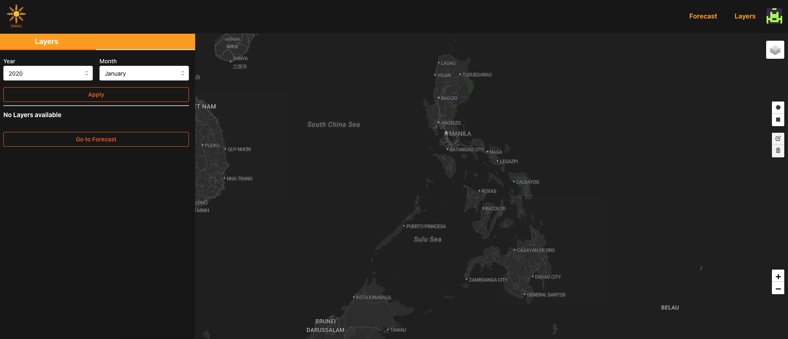

## About Me
I have experience in cloud computing, low-code platforms, and technology communities.

## Skills
- Cloud Computing
- GitHub & Git
- Geospatial Web Development
- Data Science
- Python

## Projects

### WebGIS for Project SINAG
URL: https://webgis.sinag.nec.upd.edu.ph/
Publication: https://doi.org/10.5194/isprs-archives-XLVIII-4-W8-2023-107-2024

The SINAG Web Portal is a GIS platform hosting spatial data and a forecasting model for assessing solar PV installations. It serves as a repository for outputs from the SolarPot and OutSolar components of the SINAG project. Developed with tools like Python, JavaScript, and a CMS on a cloud-based Linux system, the portal stores processed spatial data, model summaries, mapping tools, and more. It aims to support site selection for solar PV systems across the Philippines.

## Contact
You can reach me at [Email](cnpante@gmail.com) or [GitHub](nikkopante.github.io).