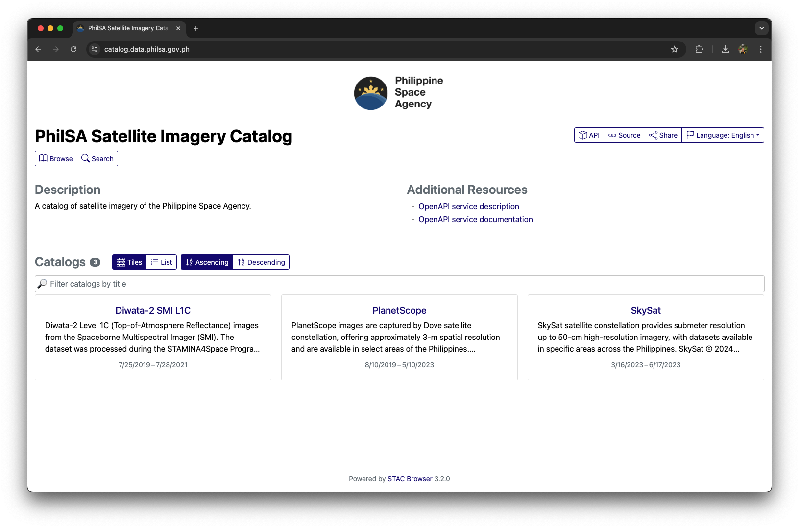
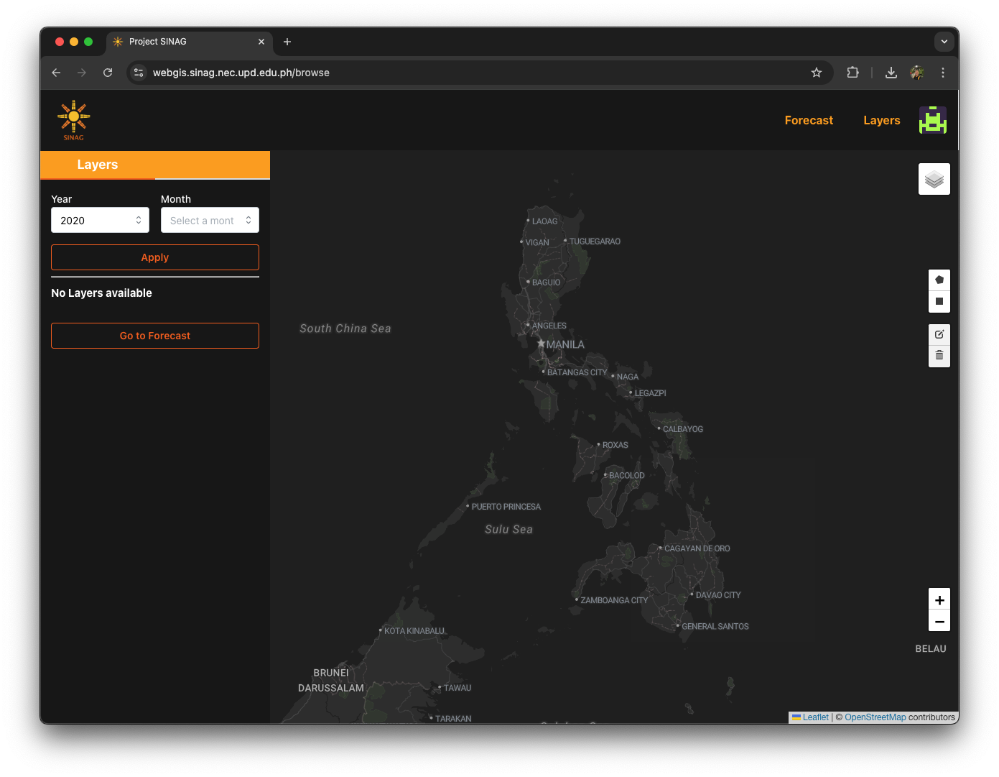
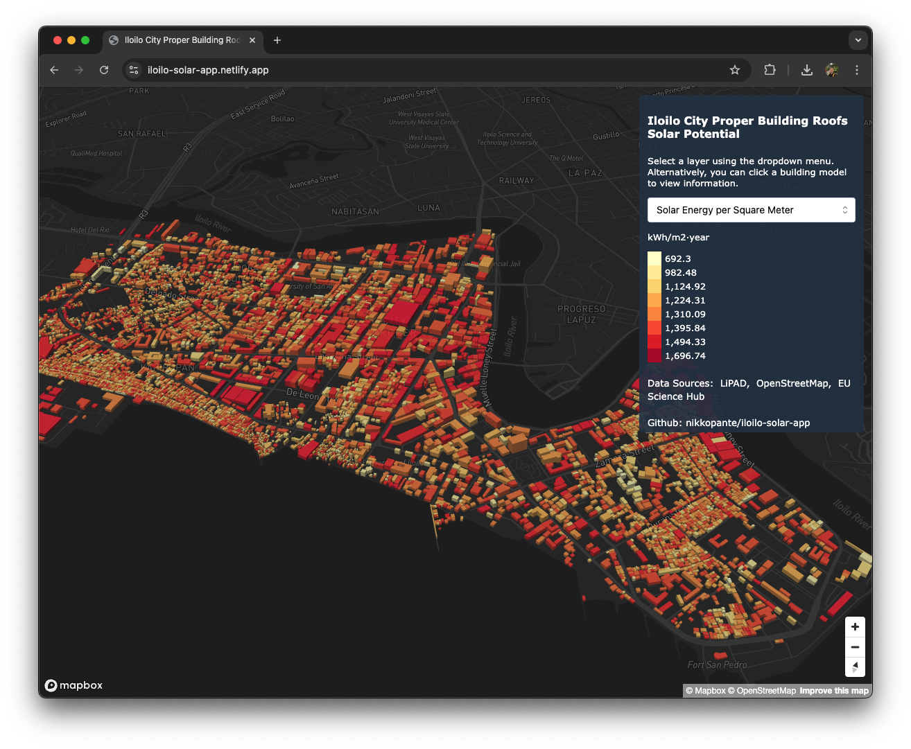
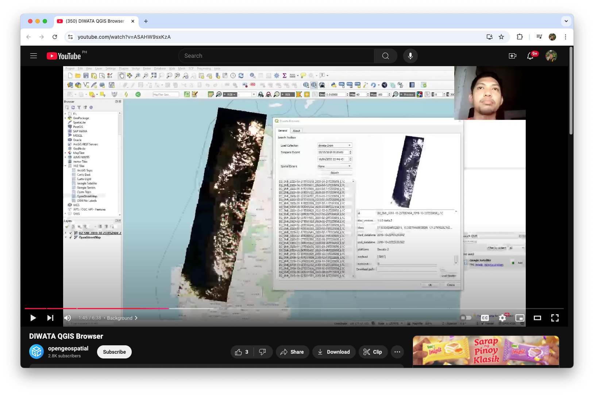

# Links
You can find other necessary information using these links
1. [Curriculum Vitae](https://docs.google.com/document/d/1sVFTg_q1Tj5vawxVBw2o2VaUMnJgwoKbeOV-5PND_7Y/edit?usp=sharing)
2. [LinkedIn](https://www.linkedin.com/in/cnpante/)

# Skills
- Cloud Computing
- GitHub & Git
- Geospatial Web Development
- Data Science
- Python
- GIS
- Remote Sensing

# Projects

### 1. PhilSA Space Data Catalog
[Link](https://catalog.data.philsa.gov.ph/)

The PhilSA Space Data Catalog lets users explore available satellite images that can be requested from the Philippine Space Agency (PhilSA). The application is built using Spatiotemporal Asset Catalog (STAC) for serving assets and Cloud Optimized GeoTIFF (COG) for seamless access of images.

### 2. PhilSA Space Data Dashboard
[Link](https://spacedata.philsa.gov.ph/) | [Publication](https://doi.org/10.5194/isprs-archives-XLVIII-4-W8-2023-219-2024)

The PhilSA Space Data Dashboard lets users access derived space data products such as Land Surface Temperature (LST), Flood Maps, Air Quality, etc. I helped setup the Geoserver backend to enable serving of data.

### 3. PhilSA ODK Central
Articles
1. [PhilSA calls on the public to use open data science for space data mobilization during disasters and emergencies](https://philsa.gov.ph/news/philsa-calls-on-the-public-to-use-open-data-science-for-space-data-mobilization-during-disasters-and-emergencies/)
2. [PINAS Project Citizen Science Network](https://philsa.gov.ph/news/pinas-project-citizen-science-network/)
3. [Be part of the mangrove mapping efforts in the Philippines!](https://philsa.gov.ph/news/be-part-of-the-mangrove-mapping-efforts-in-the-philippines/)

The PhilSA ODK Central holds the database for citizen science data collection. The application has been used for disaster validation, improve mangrove maps, and land cover classification validation. I helped set up and maintain the app.

### 4. WebGIS for Project SINAG

[Link](https://webgis.sinag.nec.upd.edu.ph/) | 
[Publication](https://doi.org/10.5194/isprs-archives-XLVIII-4-W8-2023-107-2024)

The SINAG Web Portal is a GIS platform hosting spatial data and a forecasting model for assessing solar PV installations. It serves as a repository for outputs from the SolarPot and OutSolar components of the SINAG project. Developed with tools like Python, JavaScript, and a CMS on a cloud-based Linux system, the portal stores processed spatial data, model summaries, mapping tools, and more. It aims to support site selection for solar PV systems across the Philippines.

### 5. Iloilo City Proper Building Roofs Solar Potential

[Link](https://iloilo-solar-app.netlify.app/) | 
[Repository](https://github.com/nikkopante/iloilo-solar-app)

A web application showing solar photovoltaic energy potential of buildings in Iloilo City, Philippines. This is a project under my GmE 231 (LiDAR Remote Sensing) class. We were tasked to replicate an existing study on LiDAR applications. I picked Prieto et. al (2019) study on a methodology for computing solar potential of building roofs, creating 3D models, and presenting them in a web application.

### 6. DIWATA QGIS Browser
[Presentation](https://youtu.be/ASAHW9sxKzA)

The DIWATA Image Browser is a QGIS plugin that allows users to browse and download optical images captured by the DIWATA-2 satellite, a technology demonstration satellite owned by the Philippines. This plugin utilizes STAC and COG to index, visualize, and distribute satellite images. We will demonstrate how the QGIS environment communicates with the STAC endpoint to search and retrieve desired STAC items. The plugin speeds up the workflow by letting users load the images straight to the QGIS environment, bypass data preparation, and make data ready for analysis. I was able to present this project at the Open Geospatial Consortium 2022.

### 7. DIWATA Operations Software, Image Browser, Data Pipeline, and Tracker
[STAMINA4Space](https://stamina4space.upd.edu.ph/) | 
[Diwata-2 Tracker](https://tracker.stamina4space.upd.edu.ph/)

I was able to contribute to different applications for the management, access, and processing of Diwata-2 images in the Ground Receiving, Archiving, Science Product Development and Distribution (GRASED) project under the Space Technology and Applications Mastery, Innovation, and Advancement (STAMINA4Space) program funded by the Department of Science and Technology (DOST) and implemented by the Advanced Science and Technology Institute (DOST-ASTI) and University of the Philippines Diliman.

# Research
### 1. Increasing the Awareness of the Benefits of Earth Observation Applications through the Space Information Infrastructure Capacity Building and Training Program (SIICaP)
[DOI](https://doi.org/10.5194/isprs-annals-X-5-2024-127-2024)

**Abstract.** Earth observation (EO) applications offer significant potential for addressing challenges and driving sustainable development in the Philippines. Despite the positive effect EO services can bring, its utilization encounter barriers that includes the lack of awareness of its benefits. The Philippine Space Agency (PhilSA) initiated the Space Information Infrastructure Capacity Building and Training Program (SIICaP) that aims to promote awareness of EO applications through free and inclusive online webinar platforms. This paper highlights the various webinars conducted by SIICaP showing their relevance in raising awareness of EO data, services, and programs. The analysis of evaluation results from the webinar participants further illustrates the program’s reach and success. By showcasing SIICaP, this paper contributes to efforts in developing capacity building programs that aim to have the same objectives of SIICaP.

### 2. Using LIDAR for the Solar Potential Analysis of Building Roofs ased on Urban 3D Model: A Case Study in Iloilo City, Philippines
[DOI](http://dx.doi.org/10.13140/RG.2.2.28399.82087)

**Abstract.** LiDAR data provides high-resolution images for obtaining 3D geometry of buildings. It can be used to generate high precision solar potential maps. These maps can be used when planning for solar photovoltaic infrastructure investments in building roofs. They can be especially useful when it is visualized in three-dimensional perspective since it provides an intuitive reality. This paper tests and improved a methodology conducted by Prieto et. al. (2019) on using LiDAR to develop a 3D model of solar potential on building roofs in the City Proper of Iloilo City in the Philippines. The result is a 3D web environment showing solar potential of building roofs.

### 3. Exploring the Relationship of Air Pollution, Geo-Meteorological and Social Parameters to COVID-19 Infection Rates in NCR Plus Bubble Philippines using Multiscale Geographically Weighted Regression

[DOI](http://dx.doi.org/10.13140/RG.2.2.30447.34722)

**Abstract.** The Philippines is not spared by the COVID-19 pandemic. Its epicenter Manila and neighboring provinces, or collectively known as "NCR Plus" was placed in a strict community quarantine because of resurgence of infection cases. To combat the spread of COVID-19, it is significant to study its relationship between many variables. This study aims to contribute a spatial analysis between COVID-19 infection rate and three themes of parameters-air pollution, geo-meteorological and social. Three models of Multiscale Geographically Weighted Regression (MGWR) were executed for the three themes respectively using data from January 2018 to March 2021. The statistical results revealed that air pollution, geo-meteorological and social accounted for approximately 74%, 16% and 69% of the variation in the data respectively. The spatial analysis showed that right most infection rates of NCR plus are more explained by these variables and lower areas are more susceptible of COVID-19 infection because of air pollution and social variables. Agencies can make use of these findings to formulate strategies reducing COVID-19 infection in the NCR Plus bubble.

### 4. Geothermal Site Suitability Selection using GIS in the Province of Laguna, Philippines
[DOI](http://dx.doi.org/10.13140/RG.2.2.20381.01768)

**Abstract.** The Philippines has a long term plan to maximize the supply capacity of the nation's energy through geothermal resources. Geo-thermal energy is clean and renewable but locating these resources is a costly endeavor. The use of Geographical Information Systems (GIS) and datasets can be used to select and identify potential areas for geothermal exploration. This study aims to use GIS methods composed of six evidence and two restriction layers to determine geothermal suitability of areas in Laguna. The result of this study is a map with six suitability types. The framework presented in this study can be used as an initial exploration method to narrow target areas and lessen potential cost from ground surveys.

### 5. Measuring the Usability of Bluetooth Low Energy Beacons for Information Dissemination in Academic Campuses
[Link](https://www.adnu.edu.ph/ai/2018/04/28/publications-sample-news/)

**Abstract.** Bluetooth low energy beacons make it possible to satisfy information needs among students in a school campus. This includes wayfinding, activities, services and delivering dynamic contents on a day-to-day basis. A substantial number of universities and colleges have already adopted beacon facilities. However, evidence had not yet been seen for beacon’s ease of use and user acceptance inside academic institutions. Moreover, there is a need to understand the implications of usability in order to effectively adopt beacons for campus wide applications. This study examined the usability of beacons in case of delivering university announcements to undergraduates. A prototype beacon was programmed to disseminate bulletin messages to coming students of Ateneo de Naga University to their smartphones. A notification is delivered to their Bluetooth enabled devices and consequently would lead to the message. The System Usability Scale (SUS) was used to evaluate the usability of the aforesaid setup. Undergraduate samples were asked to answer a self-administered questionnaire based on the system. The results show how the participants perceived the applicability of beacons as a tool for supplying information needs on a school campus setting.

# Contact
You can reach me at my email [cnpante@gmail.com](mailto:cnpante@gmail.com) or [social](https://www.facebook.com/cnpante1/).